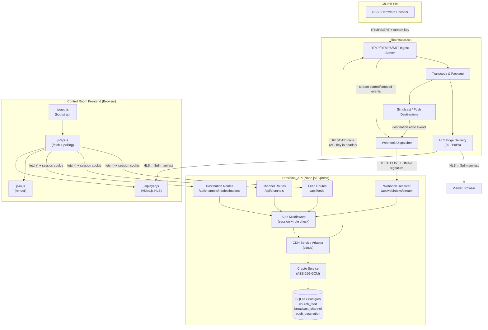
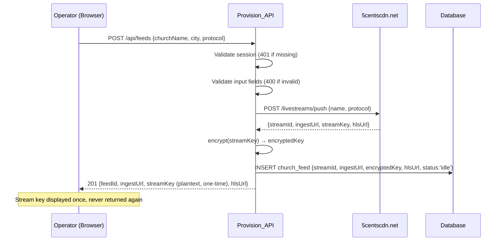
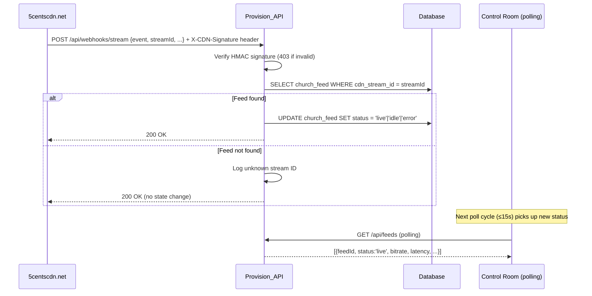
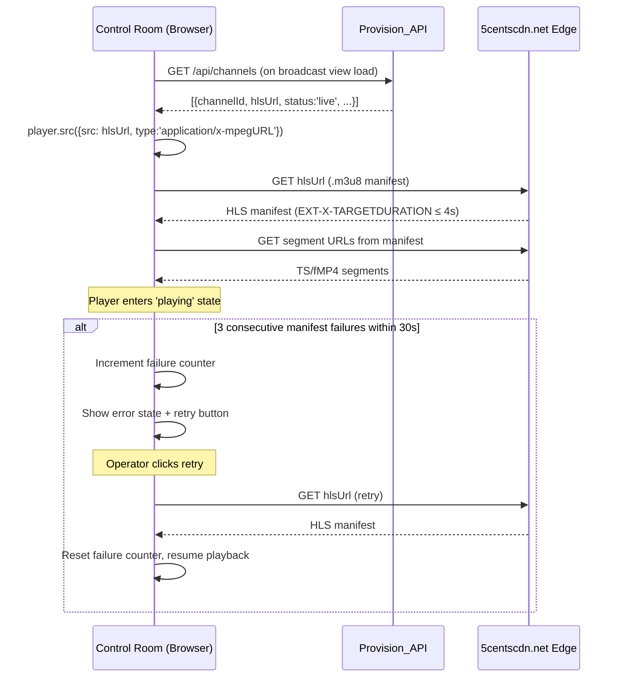
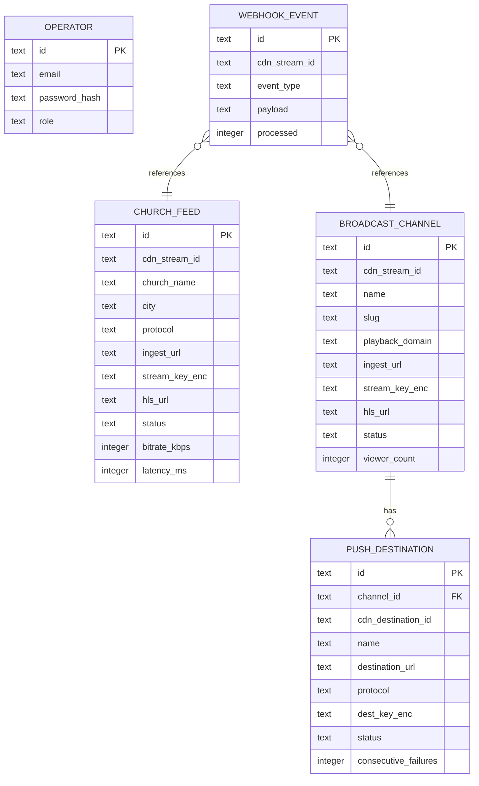

# Design Document: CDN Broadcasting Integration

## Overview

This document describes the full-stack technical design for integrating 5centscdn.net as the live broadcasting CDN for the Loveworld Networks Live platform. The integration replaces mock data in the Broadcast Control Room with real CDN-backed ingest and playback endpoints.

The system has two main parts:

1. **Provision_API** — a new Node.js/Express backend that acts as a secure adapter between the Control Room frontend and the 5centscdn.net API. It owns all CDN credentials, stores stream keys encrypted at rest, handles webhooks, and exposes a clean REST API to the frontend.

2. **Frontend API module (`js/api.js`)** — a new JavaScript module that replaces all `LW_DATA` mock calls in the Broadcast Control Room with `fetch()` calls to the Provision_API, adds polling, error handling, HLS player integration, and stream key one-time display logic.

### Key Design Decisions

- **Node.js/Express** for the backend: matches the JS-first project, minimal boilerplate, excellent ecosystem for HTTP adapters and webhook handling.
- **SQLite (via better-sqlite3) for MVP, PostgreSQL-compatible schema**: zero-infrastructure for initial deployment, easy migration path.
- **AES-256-GCM** for stream key encryption at rest: authenticated encryption prevents tampering.
- **Session-based auth with express-session + connect-sqlite3**: simple, stateless-friendly, no JWT complexity for an internal admin tool.
- **Polling over WebSockets for status updates**: simpler to implement and debug; the 15-second interval is acceptable for broadcast monitoring. WebSockets can be added later.
- **5centscdn.net API adapter pattern**: all CDN API calls are isolated in a single `cdn.js` service module, making it easy to swap providers.

---

## Architecture

### High-Level System Diagram



### Data Flow: Provisioning a Church Feed



### Data Flow: Webhook Status Update



### Data Flow: HLS Playback Startup



---

## Components and Interfaces

### Backend: Provision_API

#### Directory Structure

```
provision-api/
├── src/
│   ├── index.js              # Express app entry point
│   ├── config.js             # Environment variable loading & validation
│   ├── db.js                 # Database connection & migrations
│   ├── crypto.js             # AES-256-GCM encrypt/decrypt helpers
│   ├── middleware/
│   │   ├── auth.js           # Session authentication guard
│   │   └── webhookAuth.js    # HMAC signature verification
│   ├── services/
│   │   └── cdn.js            # 5centscdn.net API adapter
│   └── routes/
│       ├── feeds.js          # /api/feeds
│       ├── channels.js       # /api/channels
│       ├── destinations.js   # /api/channels/:id/destinations
│       ├── webhooks.js       # /api/webhooks/stream
│       └── auth.js           # /api/auth/signin, /api/auth/signout
├── migrations/
│   └── 001_initial.sql
├── .env.example
└── package.json
```

#### REST API Routes

| Method | Path | Auth Required | Description |
|--------|------|---------------|-------------|
| POST | `/api/auth/signin` | No | Operator sign-in, creates session |
| POST | `/api/auth/signout` | Yes | Destroys session |
| GET | `/api/feeds` | Yes | List all church feeds (no stream keys) |
| POST | `/api/feeds` | Yes | Provision a new church feed on CDN |
| GET | `/api/feeds/:id` | Yes | Get single feed status (no stream key) |
| DELETE | `/api/feeds/:id` | Yes | Delete idle feed |
| POST | `/api/feeds/:id/rotate-key` | Yes | Rotate stream key |
| GET | `/api/channels` | Yes | List all broadcast channels (no stream keys) |
| POST | `/api/channels` | Yes | Create a broadcast channel on CDN |
| GET | `/api/channels/:id` | Yes | Get single channel (no stream key) |
| DELETE | `/api/channels/:id` | Yes | Delete idle channel |
| POST | `/api/channels/:id/rotate-key` | Yes | Rotate channel stream key |
| GET | `/api/channels/:id/destinations` | Yes | List push destinations for channel |
| POST | `/api/channels/:id/destinations` | Yes | Add push destination |
| PATCH | `/api/channels/:id/destinations/:destId` | Yes | Pause/resume destination |
| DELETE | `/api/channels/:id/destinations/:destId` | Yes | Remove destination |
| POST | `/api/webhooks/stream` | HMAC only | Receive CDN lifecycle webhooks |
| GET | `/api/broadcast/status` | Yes | Aggregate metrics (live inputs, viewers, routes) |

#### Request/Response Shapes

**POST /api/feeds** — Request:
```json
{
  "churchName": "Christ Embassy Cape Town",
  "city": "Cape Town",
  "protocol": "RTMPS"
}
```

**POST /api/feeds** — Response 201 (stream key included once):
```json
{
  "feedId": "feed_abc123",
  "churchName": "Christ Embassy Cape Town",
  "city": "Cape Town",
  "protocol": "RTMPS",
  "ingestUrl": "rtmps://ingest.5centscdn.net/live",
  "streamKey": "sk_live_abc123xyz",
  "hlsUrl": "https://cdn.5centscdn.net/live/feed_abc123/index.m3u8",
  "status": "idle"
}
```

**GET /api/feeds** — Response 200 (no stream keys):
```json
{
  "feeds": [
    {
      "feedId": "feed_abc123",
      "churchName": "Christ Embassy Cape Town",
      "city": "Cape Town",
      "protocol": "RTMPS",
      "ingestUrl": "rtmps://ingest.5centscdn.net/live",
      "hlsUrl": "https://cdn.5centscdn.net/live/feed_abc123/index.m3u8",
      "status": "live",
      "bitrate": 4800,
      "latencyMs": 3200
    }
  ]
}
```

**POST /api/channels** — Request:
```json
{
  "name": "Global Prayer Live",
  "slug": "global-prayer",
  "playbackDomain": "live.loveworld.tv"
}
```

**POST /api/channels** — Response 201 (stream key included once):
```json
{
  "channelId": "ch_def456",
  "name": "Global Prayer Live",
  "slug": "global-prayer",
  "ingestUrl": "rtmps://ingest.5centscdn.net/live",
  "streamKey": "sk_live_def456xyz",
  "hlsUrl": "https://live.loveworld.tv/global-prayer/index.m3u8",
  "status": "idle"
}
```

**POST /api/webhooks/stream** — Payload from 5centscdn.net:
```json
{
  "event": "stream.started",
  "streamId": "cdn_stream_abc123",
  "timestamp": "2024-01-15T10:30:00Z",
  "data": {
    "bitrate": 4800,
    "latencyMs": 3200
  }
}
```

**POST /api/channels/:id/destinations** — Request:
```json
{
  "name": "YouTube Global",
  "destinationUrl": "rtmps://a.rtmp.youtube.com/live2",
  "protocol": "RTMPS",
  "streamKey": "yt_stream_key_here"
}
```

**Error Response Shape** (all errors):
```json
{
  "error": {
    "code": "CDN_QUOTA_EXCEEDED",
    "message": "CDN quota exceeded. Please contact support to increase your stream limit.",
    "field": null
  }
}
```

#### CDN Service Adapter (`cdn.js`)

The CDN adapter wraps all 5centscdn.net API calls. Based on the 5centscdn.net API documentation pattern (API key authentication, REST endpoints for livestream management), the adapter implements:

```javascript
// cdn.js interface
class CdnService {
  // Create a push stream (church feed or channel)
  async createPushStream({ name, protocol }) → { streamId, ingestUrl, streamKey, hlsUrl }

  // Delete a push stream
  async deletePushStream(streamId) → void

  // Rotate stream key
  async rotateStreamKey(streamId) → { newStreamKey }

  // Get stream status and metrics
  async getStreamStatus(streamId) → { status, bitrate, latencyMs, viewerCount }

  // Add simulcast destination
  async addSimulcastDestination(streamId, { name, destinationUrl, protocol, streamKey })
    → { destinationId }

  // Remove simulcast destination
  async removeSimulcastDestination(streamId, destinationId) → void

  // Pause/resume simulcast destination
  async setSimulcastDestinationState(streamId, destinationId, state) → void
}
```

The adapter sets the `Authorization: Bearer ${CDN_API_KEY}` header on all requests and maps 5centscdn.net error codes to the Provision_API error format.

### Frontend: New and Modified Modules

#### New Module: `js/api.js`

This module is the single point of contact between the frontend and the Provision_API. It replaces all `LW_DATA` references in the Broadcast Control Room.

```javascript
// js/api.js — public interface
const LWAPI = (() => {
  // Core fetch wrapper with auth redirect on 401
  async function apiFetch(path, options) → Response

  // Broadcast data
  async function getBroadcastStatus() → { feeds, channels, destinations, metrics }
  async function provisionFeed({ churchName, city, protocol }) → { feedId, ingestUrl, streamKey, hlsUrl }
  async function createChannel({ name, slug, playbackDomain }) → { channelId, ingestUrl, streamKey, hlsUrl }
  async function deleteChannel(channelId) → void
  async function rotateKey(resourceType, resourceId) → void

  // Destinations
  async function addDestination(channelId, { name, destinationUrl, protocol, streamKey }) → { destId }
  async function setDestinationState(channelId, destId, state) → void
  async function deleteDestination(channelId, destId) → void

  // Polling
  function startPolling(intervalMs, onUpdate, onError) → stopFn
  function stopPolling(stopFn) → void

  return { apiFetch, getBroadcastStatus, provisionFeed, createChannel,
           deleteChannel, rotateKey, addDestination, setDestinationState,
           deleteDestination, startPolling, stopPolling };
})();
```

#### Modified Module: `js/ui.js`

The `renderBroadcastNetwork`, `renderBroadcastChannels`, `renderDistributionRoutes`, `provisionFeed`, `createBroadcastChannel`, and `createDistributionRoute` functions are updated to accept data parameters instead of reading from `LW_DATA`. The `LW_DATA` object remains for non-broadcast views (events, churches, channels, map).

#### Modified Module: `js/player.js`

The `open(channel)` function is updated to accept an `hlsUrl` from the API response rather than from `LW_DATA`. A failure counter and retry mechanism are added.

#### Modified Module: `js/app.js`

The broadcast section of `app.js` is updated to:
1. Call `LWAPI.getBroadcastStatus()` on broadcast view load
2. Start the 15-second polling loop
3. Wire form submissions to `LWAPI.provisionFeed()`, `LWAPI.createChannel()`, `LWAPI.addDestination()`
4. Handle stream key one-time display after provisioning
5. Handle API error banners

---

## Data Models

### Database Schema

```sql
-- migrations/001_initial.sql

-- Operators who can manage the broadcast system
CREATE TABLE operator (
  id          TEXT PRIMARY KEY,           -- UUID
  email       TEXT NOT NULL UNIQUE,
  password_hash TEXT NOT NULL,            -- bcrypt hash
  role        TEXT NOT NULL DEFAULT 'operator', -- 'operator' | 'admin'
  created_at  TEXT NOT NULL DEFAULT (datetime('now'))
);

-- Church ingest feeds (one per church encoder)
CREATE TABLE church_feed (
  id                TEXT PRIMARY KEY,     -- UUID, internal
  cdn_stream_id     TEXT NOT NULL UNIQUE, -- ID returned by 5centscdn.net
  church_name       TEXT NOT NULL,
  city              TEXT NOT NULL,
  protocol          TEXT NOT NULL CHECK (protocol IN ('RTMPS', 'SRT')),
  ingest_url        TEXT NOT NULL,        -- RTMPS/SRT ingest endpoint from CDN
  stream_key_enc    TEXT NOT NULL,        -- AES-256-GCM encrypted stream key
  stream_key_iv     TEXT NOT NULL,        -- Base64 IV for decryption
  stream_key_tag    TEXT NOT NULL,        -- Base64 auth tag for GCM
  hls_url           TEXT NOT NULL,        -- HLS playback URL from CDN
  status            TEXT NOT NULL DEFAULT 'idle' CHECK (status IN ('idle', 'live', 'error')),
  bitrate_kbps      INTEGER,              -- Last known bitrate (kbps)
  latency_ms        INTEGER,              -- Last known latency (ms)
  created_at        TEXT NOT NULL DEFAULT (datetime('now')),
  updated_at        TEXT NOT NULL DEFAULT (datetime('now'))
);

-- Broadcast channels (named Loveworld channels)
CREATE TABLE broadcast_channel (
  id                TEXT PRIMARY KEY,     -- UUID, internal
  cdn_stream_id     TEXT NOT NULL UNIQUE, -- ID returned by 5centscdn.net
  name              TEXT NOT NULL,
  slug              TEXT NOT NULL UNIQUE, -- URL-safe identifier
  playback_domain   TEXT NOT NULL,
  ingest_url        TEXT NOT NULL,
  stream_key_enc    TEXT NOT NULL,
  stream_key_iv     TEXT NOT NULL,
  stream_key_tag    TEXT NOT NULL,
  hls_url           TEXT NOT NULL,
  status            TEXT NOT NULL DEFAULT 'idle' CHECK (status IN ('idle', 'live', 'error')),
  viewer_count      INTEGER DEFAULT 0,
  created_at        TEXT NOT NULL DEFAULT (datetime('now')),
  updated_at        TEXT NOT NULL DEFAULT (datetime('now'))
);

-- Push destinations (simulcast targets per channel)
CREATE TABLE push_destination (
  id                TEXT PRIMARY KEY,     -- UUID, internal
  channel_id        TEXT NOT NULL REFERENCES broadcast_channel(id) ON DELETE CASCADE,
  cdn_destination_id TEXT NOT NULL,       -- ID returned by 5centscdn.net
  name              TEXT NOT NULL,
  destination_url   TEXT NOT NULL,
  protocol          TEXT NOT NULL CHECK (protocol IN ('RTMP', 'RTMPS', 'SRT', 'HLS')),
  dest_key_enc      TEXT,                 -- Encrypted destination stream key (nullable)
  dest_key_iv       TEXT,
  dest_key_tag      TEXT,
  status            TEXT NOT NULL DEFAULT 'paused' CHECK (status IN ('sending', 'paused', 'error')),
  consecutive_failures INTEGER DEFAULT 0,
  last_failure_at   TEXT,
  created_at        TEXT NOT NULL DEFAULT (datetime('now')),
  updated_at        TEXT NOT NULL DEFAULT (datetime('now')),
  UNIQUE (channel_id, destination_url)    -- Prevents duplicate destinations per channel
);

-- Webhook event log (for debugging and idempotency)
CREATE TABLE webhook_event (
  id            TEXT PRIMARY KEY,         -- UUID
  cdn_stream_id TEXT NOT NULL,
  event_type    TEXT NOT NULL,            -- 'stream.started' | 'stream.stopped' | 'stream.error' | 'destination.error'
  payload       TEXT NOT NULL,            -- Raw JSON payload
  processed     INTEGER NOT NULL DEFAULT 0, -- 0 = unprocessed, 1 = processed
  received_at   TEXT NOT NULL DEFAULT (datetime('now'))
);

-- Indexes
CREATE INDEX idx_church_feed_cdn_stream_id ON church_feed(cdn_stream_id);
CREATE INDEX idx_broadcast_channel_slug ON broadcast_channel(slug);
CREATE INDEX idx_push_destination_channel_id ON push_destination(channel_id);
CREATE INDEX idx_webhook_event_cdn_stream_id ON webhook_event(cdn_stream_id);
```

### Entity Relationships



### Stream Key Encryption

Stream keys are encrypted using AES-256-GCM before storage. The encryption key is derived from the `STREAM_KEY_SECRET` environment variable using PBKDF2.

```javascript
// crypto.js
const crypto = require('crypto');

const ALGORITHM = 'aes-256-gcm';
const KEY_LENGTH = 32; // 256 bits
const IV_LENGTH = 12;  // 96 bits (recommended for GCM)

function deriveKey(secret) {
  return crypto.pbkdf2Sync(secret, 'loveworld-salt-v1', 100_000, KEY_LENGTH, 'sha256');
}

function encrypt(plaintext, secret) {
  const key = deriveKey(secret);
  const iv = crypto.randomBytes(IV_LENGTH);
  const cipher = crypto.createCipheriv(ALGORITHM, key, iv);
  const encrypted = Buffer.concat([cipher.update(plaintext, 'utf8'), cipher.final()]);
  const tag = cipher.getAuthTag();
  return {
    enc: encrypted.toString('base64'),
    iv: iv.toString('base64'),
    tag: tag.toString('base64'),
  };
}

function decrypt({ enc, iv, tag }, secret) {
  const key = deriveKey(secret);
  const decipher = crypto.createDecipheriv(ALGORITHM, key, Buffer.from(iv, 'base64'));
  decipher.setAuthTag(Buffer.from(tag, 'base64'));
  return Buffer.concat([
    decipher.update(Buffer.from(enc, 'base64')),
    decipher.final(),
  ]).toString('utf8');
}

module.exports = { encrypt, decrypt };
```

---

## Correctness Properties

*A property is a characteristic or behavior that should hold true across all valid executions of a system — essentially, a formal statement about what the system should do. Properties serve as the bridge between human-readable specifications and machine-verifiable correctness guarantees.*

#### Redundancy Analysis

Before listing properties, redundancies are eliminated:

- Requirements 1.3 and 6.2 both state that stream keys must not appear after initial provisioning. These are combined into **Property 2**.
- Requirements 2.2 and 2.4 are both webhook-to-status-transition properties. They are combined into **Property 3** (webhook idempotency and state transition).
- Requirements 4.1 and 1.1 both test provisioning completeness (all required fields returned). They are combined into **Property 1**.
- Requirements 4.5 and 5.2 both test uniqueness constraints (slug and destination URL). They are combined into **Property 5**.
- Requirements 4.8 tests deletion guard on active channels. This is a distinct state guard property — **Property 6**.
- Requirements 6.6 and 6.7 both test authentication guards. They are combined into **Property 8**.
- Requirements 7.3 and 7.5 both test data consistency under polling. They are combined into **Property 10**.

---

### Property 1: Provisioning returns all required fields for any valid input

*For any* valid provisioning request (church feed or broadcast channel) with non-empty name, city/slug, and a supported protocol, the Provision_API SHALL return a response containing a non-empty `ingestUrl`, a non-empty `streamKey`, and a non-empty `hlsUrl`, and the `streamKey` values across two distinct provisioning calls SHALL be different.

**Validates: Requirements 1.1, 4.1**

---

### Property 2: Stream key never returned after initial provisioning

*For any* provisioned church feed or broadcast channel, every API response from GET endpoints (list or single resource) SHALL NOT contain the plaintext stream key. The stream key SHALL only appear in the initial POST provisioning response.

**Validates: Requirements 1.3, 6.2**

---

### Property 3: Webhook status transitions are correct and idempotent

*For any* valid webhook payload with a recognized stream ID:
- A `stream.started` event SHALL transition the corresponding feed/channel status to `live`
- A `stream.stopped` event SHALL transition the status to `idle`
- Delivering the same webhook event multiple times SHALL result in the same final status (idempotent)

*For any* webhook payload with an unrecognized stream ID, no feed or channel record SHALL be modified, and the API SHALL return HTTP 200.

**Validates: Requirements 2.2, 2.4, 2.5**

---

### Property 4: HLS retry logic triggers error state after exactly 3 consecutive failures within 30 seconds

*For any* sequence of HLS manifest fetch attempts where 3 or more consecutive failures occur within a 30-second window, the player SHALL enter the error state and display a retry button. *For any* sequence where fewer than 3 consecutive failures occur, or where failures are separated by more than 30 seconds, the player SHALL NOT enter the error state.

**Validates: Requirements 3.5**

---

### Property 5: Uniqueness constraints are enforced for slugs and destination URLs

*For any* broadcast channel slug that already exists in the system, a POST /api/channels request with that slug SHALL return HTTP 409. *For any* destination URL already registered against a specific broadcast channel, a POST /api/channels/:id/destinations request with that URL SHALL return HTTP 409.

**Validates: Requirements 4.5, 5.2**

---

### Property 6: Active channels cannot be deleted

*For any* broadcast channel or church feed whose status is `live` or `error`, a DELETE request SHALL return HTTP 409. *For any* resource whose status is `idle`, a DELETE request SHALL succeed with HTTP 200.

**Validates: Requirements 4.7, 4.8**

---

### Property 7: Stream keys are stored encrypted and round-trip correctly

*For any* stream key plaintext value, the value stored in the database SHALL differ from the plaintext (i.e., it is encrypted), and `decrypt(encrypt(plaintext)) == plaintext`. After a key rotation, the new encrypted value stored in the database SHALL decrypt to a value different from the previous plaintext key.

**Validates: Requirements 6.1, 6.4**

---

### Property 8: All protected endpoints reject unauthenticated and invalid requests

*For any* protected API endpoint (feeds, channels, destinations, rotate-key), a request with a missing session token, an expired session token, or an invalid session token SHALL receive HTTP 401. *For any* webhook request with an invalid HMAC signature, the Provision_API SHALL return HTTP 403 and SHALL NOT process the payload.

**Validates: Requirements 6.6, 6.7**

---

### Property 9: Input validation rejects all forms with missing required fields

*For any* form submission (Add Church Feed, Create Channel, Add Destination) where one or more required fields are empty or contain only whitespace characters, the Control Room SHALL display a field-level validation error and SHALL NOT submit the request to the Provision_API.

**Validates: Requirements 1.6**

---

### Property 10: Polling retains last good data on failure and reflects API data when reachable

*For any* sequence of polling cycles where at least one cycle succeeds before subsequent failures, the Control Room SHALL continue displaying the data from the last successful cycle during the failure period. *For any* successful API response containing metric counts (liveInputs, cdnViewers, pushDestinations), the corresponding DOM counter elements SHALL display exactly those values.

**Validates: Requirements 7.3, 7.5**

---

## Error Handling

### Backend Error Handling Strategy

All errors are returned in a consistent JSON envelope:

```json
{
  "error": {
    "code": "MACHINE_READABLE_CODE",
    "message": "Human-readable description of the failure.",
    "field": "fieldName or null"
  }
}
```

| Scenario | HTTP Status | Error Code |
|----------|-------------|------------|
| Missing/invalid session | 401 | `UNAUTHORIZED` |
| Invalid webhook signature | 403 | `INVALID_WEBHOOK_SIGNATURE` |
| Resource not found | 404 | `NOT_FOUND` |
| Slug/URL already exists | 409 | `CONFLICT_SLUG` / `CONFLICT_DESTINATION_URL` |
| Delete active resource | 409 | `CANNOT_DELETE_ACTIVE` |
| CDN quota exceeded | 502 | `CDN_QUOTA_EXCEEDED` |
| CDN API unreachable | 502 | `CDN_UNAVAILABLE` |
| CDN returned unexpected error | 502 | `CDN_ERROR` |
| Key rotation CDN failure | 502 | `KEY_ROTATION_FAILED` |
| Input validation failure | 400 | `VALIDATION_ERROR` |
| Internal server error | 500 | `INTERNAL_ERROR` |

### CDN Error Mapping

The `cdn.js` adapter catches all 5centscdn.net API errors and maps them to Provision_API error codes before they reach the route handlers. This isolates CDN-specific error formats from the frontend.

### Webhook Error Handling

- Invalid HMAC signature → 403, no state change, log warning
- Unknown stream ID → 200, no state change, log info
- Valid payload, DB update fails → 500, log error (CDN will retry)
- Duplicate webhook event (same event ID) → 200, no state change (idempotent)

### Frontend Error Handling

**API Error Banner**: Displayed when `getBroadcastStatus()` fails or times out (>10s). The banner shows a human-readable message and a dismiss button. It does not appear for individual failed poll cycles after the first successful load — the last good data is retained silently.

**Form Inline Errors**: Each form field displays an error message below it when validation fails or when the API returns a `field`-specific error (e.g., slug conflict on the slug input).

**Stream Key One-Time Display**: After provisioning, the stream key is shown in a highlighted box with a copy button. A warning states "This key will not be shown again." The key is stored in a `sessionStorage` entry keyed by `feedId`/`channelId` so it survives a page refresh within the same browser session but is cleared when the tab closes.

**HLS Player Error State**: When 3 consecutive manifest failures occur within 30 seconds, the player stage is replaced with an error card containing the message "Stream unavailable" and a "Retry" button. Clicking retry resets the failure counter and calls `player.src()` again.

**Auth Redirect**: Any API response with HTTP 401 triggers `window.location.href = '/auth/signin'` (or opens the auth modal if the sign-in flow is in-page).

**Push Destination Status**: The destination list polls every 5 seconds when the broadcast view is active. Status changes are reflected immediately on the next poll cycle.

---

## Testing Strategy

### Overview

The testing strategy uses a dual approach: property-based tests for universal correctness properties and example-based unit/integration tests for specific behaviors, edge cases, and UI interactions.

**Property-Based Testing Library**: [fast-check](https://github.com/dubzzz/fast-check) (JavaScript, works in both Node.js and browser environments).

Each property test runs a minimum of 100 iterations. Tests are tagged with a comment referencing the design property they validate.

---

### Backend Unit Tests (Jest + fast-check)

#### Property Tests

**Property 1: Provisioning returns all required fields**
```javascript
// Feature: cdn-broadcasting-integration, Property 1: Provisioning returns all required fields
it('provisionFeed returns ingestUrl, streamKey, hlsUrl for any valid input', async () => {
  await fc.assert(fc.asyncProperty(
    fc.record({
      churchName: fc.string({ minLength: 1, maxLength: 100 }),
      city: fc.string({ minLength: 1, maxLength: 100 }),
      protocol: fc.constantFrom('RTMPS', 'SRT'),
    }),
    async (input) => {
      const result = await feedService.provision(input, mockCdnClient);
      expect(result.ingestUrl).toBeTruthy();
      expect(result.streamKey).toBeTruthy();
      expect(result.hlsUrl).toBeTruthy();
    }
  ), { numRuns: 100 });
});
```

**Property 2: Stream key never returned after initial provisioning**
```javascript
// Feature: cdn-broadcasting-integration, Property 2: Stream key never returned after initial provisioning
it('GET /api/feeds/:id never returns plaintext stream key', async () => {
  await fc.assert(fc.asyncProperty(
    fc.record({ churchName: fc.string({ minLength: 1 }), city: fc.string({ minLength: 1 }), protocol: fc.constantFrom('RTMPS', 'SRT') }),
    async (input) => {
      const { feedId, streamKey } = await feedService.provision(input, mockCdnClient);
      const fetched = await feedService.getById(feedId);
      expect(fetched).not.toHaveProperty('streamKey', streamKey);
      expect(fetched.streamKey).toBeUndefined();
    }
  ), { numRuns: 100 });
});
```

**Property 3: Webhook status transitions are correct and idempotent**
```javascript
// Feature: cdn-broadcasting-integration, Property 3: Webhook status transitions are correct and idempotent
it('stream.started webhook transitions any known feed to live status', async () => {
  await fc.assert(fc.asyncProperty(
    fc.record({ churchName: fc.string({ minLength: 1 }), city: fc.string({ minLength: 1 }), protocol: fc.constantFrom('RTMPS', 'SRT') }),
    async (input) => {
      const { feedId, cdnStreamId } = await feedService.provision(input, mockCdnClient);
      await webhookService.process({ event: 'stream.started', streamId: cdnStreamId });
      const feed = await feedService.getById(feedId);
      expect(feed.status).toBe('live');
      // Idempotency: process again
      await webhookService.process({ event: 'stream.started', streamId: cdnStreamId });
      const feedAgain = await feedService.getById(feedId);
      expect(feedAgain.status).toBe('live');
    }
  ), { numRuns: 100 });
});

it('unknown stream ID webhook does not modify any feed', async () => {
  await fc.assert(fc.asyncProperty(
    fc.string({ minLength: 1, maxLength: 50 }),
    async (unknownId) => {
      const before = await feedService.listAll();
      await webhookService.process({ event: 'stream.started', streamId: `unknown_${unknownId}` });
      const after = await feedService.listAll();
      expect(after).toEqual(before);
    }
  ), { numRuns: 100 });
});
```

**Property 5: Uniqueness constraints enforced**
```javascript
// Feature: cdn-broadcasting-integration, Property 5: Uniqueness constraints enforced
it('creating a channel with an existing slug returns 409', async () => {
  await fc.assert(fc.asyncProperty(
    fc.string({ minLength: 3, maxLength: 30 }).map(s => s.toLowerCase().replace(/[^a-z0-9]/g, '-')),
    async (slug) => {
      await channelService.create({ name: 'Test', slug, playbackDomain: 'live.loveworld.tv' }, mockCdnClient);
      await expect(
        channelService.create({ name: 'Test2', slug, playbackDomain: 'live.loveworld.tv' }, mockCdnClient)
      ).rejects.toMatchObject({ statusCode: 409, code: 'CONFLICT_SLUG' });
    }
  ), { numRuns: 100 });
});
```

**Property 6: Active channels cannot be deleted**
```javascript
// Feature: cdn-broadcasting-integration, Property 6: Active channels cannot be deleted
it('DELETE on live or error channel returns 409', async () => {
  await fc.assert(fc.asyncProperty(
    fc.constantFrom('live', 'error'),
    async (status) => {
      const { channelId } = await channelService.create({ name: 'Test', slug: `test-${Date.now()}`, playbackDomain: 'live.loveworld.tv' }, mockCdnClient);
      await db.run('UPDATE broadcast_channel SET status = ? WHERE id = ?', [status, channelId]);
      await expect(channelService.delete(channelId, mockCdnClient))
        .rejects.toMatchObject({ statusCode: 409, code: 'CANNOT_DELETE_ACTIVE' });
    }
  ), { numRuns: 100 });
});
```

**Property 7: Stream key encryption round-trip**
```javascript
// Feature: cdn-broadcasting-integration, Property 7: Stream key encryption round-trip
it('encrypt then decrypt returns original plaintext for any string', () => {
  fc.assert(fc.property(
    fc.string({ minLength: 1, maxLength: 200 }),
    (plaintext) => {
      const encrypted = encrypt(plaintext, process.env.STREAM_KEY_SECRET);
      const decrypted = decrypt(encrypted, process.env.STREAM_KEY_SECRET);
      expect(decrypted).toBe(plaintext);
      expect(encrypted.enc).not.toBe(plaintext);
    }
  ), { numRuns: 200 });
});
```

**Property 8: Protected endpoints reject unauthenticated requests**
```javascript
// Feature: cdn-broadcasting-integration, Property 8: Protected endpoints reject unauthenticated requests
it('all protected endpoints return 401 without a valid session', async () => {
  const protectedRoutes = [
    { method: 'GET', path: '/api/feeds' },
    { method: 'POST', path: '/api/feeds' },
    { method: 'GET', path: '/api/channels' },
    { method: 'POST', path: '/api/channels' },
    { method: 'POST', path: '/api/channels/ch_123/destinations' },
  ];
  await fc.assert(fc.asyncProperty(
    fc.constantFrom(...protectedRoutes),
    fc.option(fc.string(), { nil: undefined }), // random or missing token
    async (route, token) => {
      const headers = token ? { Authorization: `Bearer ${token}` } : {};
      const res = await request(app)[route.method.toLowerCase()](route.path).set(headers);
      expect(res.status).toBe(401);
    }
  ), { numRuns: 100 });
});
```

**Property 10: Polling retains last good data on failure**
```javascript
// Feature: cdn-broadcasting-integration, Property 10: Polling retains last good data on failure
it('failed poll cycles do not overwrite last successful data', async () => {
  await fc.assert(fc.asyncProperty(
    fc.array(fc.boolean(), { minLength: 2, maxLength: 20 }).filter(arr => arr.some(Boolean)),
    async (successPattern) => {
      // successPattern[i] = true means poll i succeeds, false means it fails
      let lastGoodData = null;
      let displayedData = null;
      for (const succeeds of successPattern) {
        if (succeeds) {
          lastGoodData = await mockSuccessfulPoll();
          displayedData = lastGoodData;
        } else {
          await mockFailedPoll();
          // displayedData should remain lastGoodData
        }
        expect(displayedData).toEqual(lastGoodData);
      }
    }
  ), { numRuns: 100 });
});
```

---

#### Example-Based Unit Tests

- `POST /api/feeds` with missing `churchName` returns 400 with `field: 'churchName'`
- `POST /api/feeds` with missing `city` returns 400 with `field: 'city'`
- `POST /api/feeds` with unsupported protocol returns 400
- CDN error during provisioning returns 502 with human-readable message
- Key rotation success: new key differs from old key, stored encrypted
- Key rotation CDN failure: existing key unchanged, 502 returned
- Webhook with invalid HMAC signature returns 403
- `DELETE /api/channels/:id` on idle channel returns 200

---

### Frontend Unit Tests (Jest + jsdom + fast-check)

**Property 4: HLS retry logic**
```javascript
// Feature: cdn-broadcasting-integration, Property 4: HLS retry logic triggers error state
it('error state shown after exactly 3 consecutive failures within 30s', () => {
  fc.assert(fc.property(
    fc.integer({ min: 3, max: 10 }), // number of consecutive failures
    fc.array(fc.integer({ min: 0, max: 29000 }), { minLength: 3, maxLength: 10 }), // timestamps within 30s
    (failureCount, timestamps) => {
      const retryTracker = createRetryTracker({ maxFailures: 3, windowMs: 30_000 });
      const sortedTimestamps = [...timestamps].sort((a, b) => a - b).slice(0, failureCount);
      sortedTimestamps.forEach(ts => retryTracker.recordFailure(ts));
      expect(retryTracker.shouldShowError()).toBe(true);
    }
  ), { numRuns: 200 });
});

it('error state NOT shown when failures are spread beyond 30s window', () => {
  fc.assert(fc.property(
    fc.array(fc.integer({ min: 31000, max: 120000 }), { minLength: 3, maxLength: 10 }),
    (gaps) => {
      const retryTracker = createRetryTracker({ maxFailures: 3, windowMs: 30_000 });
      let time = 0;
      gaps.forEach(gap => {
        time += gap;
        retryTracker.recordFailure(time);
      });
      expect(retryTracker.shouldShowError()).toBe(false);
    }
  ), { numRuns: 200 });
});
```

**Property 9: Form validation rejects missing/whitespace fields**
```javascript
// Feature: cdn-broadcasting-integration, Property 9: Input validation rejects missing required fields
it('Add Church Feed form rejects any input with empty or whitespace-only required fields', () => {
  fc.assert(fc.property(
    fc.record({
      churchName: fc.oneof(fc.constant(''), fc.string().map(s => s.replace(/\S/g, ' '))),
      city: fc.string({ minLength: 1 }),
      protocol: fc.constantFrom('RTMPS', 'SRT'),
    }),
    (input) => {
      const result = validateFeedForm(input);
      expect(result.valid).toBe(false);
      expect(result.errors.churchName).toBeTruthy();
    }
  ), { numRuns: 200 });
});
```

**Example-Based Frontend Tests**:
- Broadcast view load calls `LWAPI.getBroadcastStatus()`, not `LW_DATA`
- API timeout (>10s) shows error banner and empty lists
- HTTP 401 response triggers auth redirect
- Clipboard copy success shows "Copied" confirmation
- Clipboard copy failure shows URL in text field
- Stream key displayed after provisioning, not shown on subsequent GET
- Destination status refreshes within 5 seconds of status change

---

### Integration Tests

- `POST /api/feeds` with real 5centscdn.net sandbox: verify ingest URL and HLS URL are valid URLs
- Webhook delivery: simulate CDN webhook, verify feed status updates in DB
- HLS manifest: verify `EXT-X-TARGETDURATION` ≤ 4 in live stream manifest
- End-to-end: provision feed → encoder connects → webhook received → status shows `live` in Control Room

---

### Environment Configuration

```bash
# provision-api/.env.example

# Server
PORT=3001
NODE_ENV=development

# Session
SESSION_SECRET=change-me-to-a-long-random-string

# Database
DATABASE_URL=./data/provision.db

# 5centscdn.net API
CDN_API_KEY=your-5centscdn-api-key
CDN_API_BASE_URL=https://api.5centscdn.net/v2
CDN_WEBHOOK_SECRET=your-webhook-shared-secret

# Stream key encryption
STREAM_KEY_SECRET=change-me-to-a-32-char-random-string

# CORS (comma-separated allowed origins)
CORS_ORIGINS=http://localhost:5500,https://live.loveworld.tv
```

All secrets are loaded and validated at startup via `config.js`. If any required variable is missing, the process exits with a clear error message before accepting any requests.
