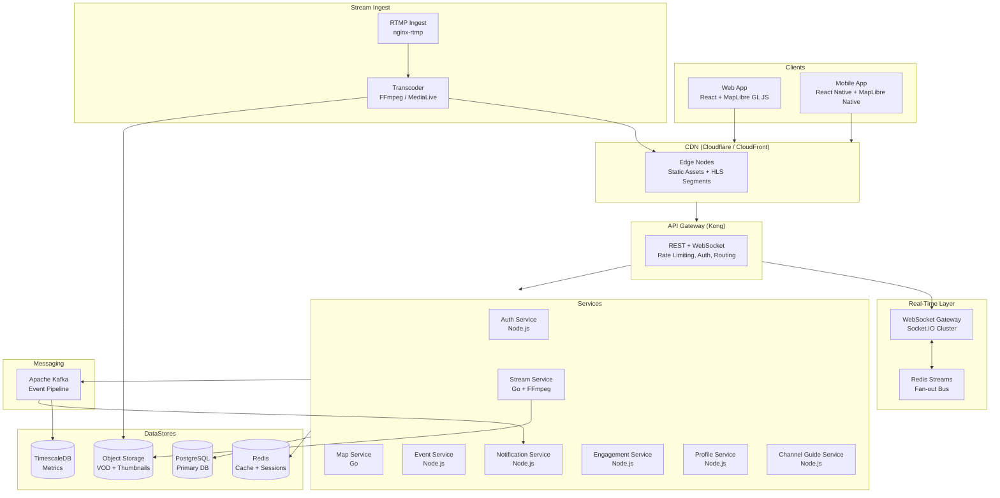
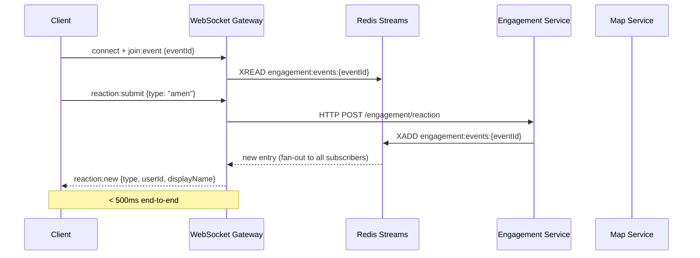

# Design Document: Loveworld Networks Live Interactive Platform

## Overview

The Loveworld Networks Live Interactive Platform is a real-time, community-driven web and mobile application that unifies a global live map, multi-channel live streaming, event discovery, and community engagement into a single cohesive experience. It serves Loveworld's global audience — spanning all seven channel regions — enabling participants to discover live events, watch broadcasts, check in, react, and feel connected to a worldwide community in real time.

### Key Design Goals

- **Real-time first**: Map pins, reactions, check-ins, and activity feeds must update within seconds, not minutes.
- **Scale at peak**: The platform must sustain 50,000+ concurrent video viewers per channel and 500,000+ event registrations without degradation.
- **Global reach**: Static assets and video delivery via CDN edge nodes covering all Loveworld channel regions.
- **Graceful degradation**: Every feature must have a defined fallback when a backend service is unavailable.
- **Accessibility and i18n**: WCAG 2.1 AA compliance and seven interface languages are non-negotiable constraints, not afterthoughts.

### Technology Decisions Summary

| Concern | Choice | Rationale |
|---|---|---|
| Map library | **MapLibre GL JS** (web) + **MapLibre Native** (mobile) | Open-source WebGL fork of Mapbox GL JS; no per-tile pricing lock-in; handles 10K+ pins at 60 fps via GPU rendering; identical API surface to Mapbox GL JS |
| Tile provider | **Mapbox** or **OpenFreeMap** (self-hosted) | MapLibre decouples the renderer from the tile provider; Mapbox tiles can be swapped for self-hosted OpenFreeMap tiles to eliminate per-request costs |
| Video player | **Video.js** with `@videojs/http-streaming` (VHS) plugin | Supports both HLS and DASH natively; mature plugin ecosystem; accessible controls out of the box; works on all target browsers |
| Real-time transport | **WebSocket** (Socket.IO) for bidirectional events (reactions, check-ins, presence); **SSE** fallback for read-only feeds | WebSocket is required for client→server reactions; SSE is simpler for pure server-push (activity feed) but WebSocket covers both directions |
| Message broker | **Redis Streams** (primary) + **Apache Kafka** (high-volume event pipeline) | Redis Streams handles low-latency fan-out to WebSocket servers; Kafka handles durable event ingestion for analytics and notification pipelines |
| Auth | **JWT** (RS256) issued by Auth Service; **KingsChat OAuth 2.0** via PKCE flow | Stateless tokens scale horizontally; KingsChat SDK provides the OAuth integration |
| Frontend framework | **React** (web) + **React Native** (mobile) | Shared component logic; large ecosystem; strong accessibility tooling |
| Backend language | **Node.js** (TypeScript) for real-time services; **Go** for high-throughput Map and Stream services | Node.js excels at I/O-bound WebSocket fan-out; Go excels at CPU-bound geo-clustering and stream proxying |
| Database | **PostgreSQL** (primary relational store); **Redis** (cache + pub/sub); **TimescaleDB** (time-series metrics) | PostgreSQL for events, users, churches; Redis for session cache and real-time counters; TimescaleDB for viewer counts and reaction aggregates |

---

## Architecture

### High-Level System Diagram



### Deployment Topology

- **Web App**: Deployed as a static SPA to CDN (Cloudflare Pages or AWS CloudFront + S3).
- **Mobile App**: React Native builds distributed via App Store and Google Play.
- **Backend Services**: Containerized (Docker), orchestrated via Kubernetes (EKS or GKE). Each service is independently deployable.
- **WebSocket Gateway**: Horizontally scaled Socket.IO cluster with Redis adapter for cross-node pub/sub.
- **CDN**: Cloudflare or AWS CloudFront with edge nodes in all Loveworld channel regions (Africa, Americas, Europe, Middle East, Asia-Pacific).
- **Video Ingest**: RTMP ingest via nginx-rtmp or AWS MediaLive; transcoded to HLS/DASH multi-bitrate; segments pushed to CDN origin.

---

## Components and Interfaces

### Frontend Components

#### Web Application (React)

```
src/
  components/
    map/
      LiveMap.tsx           # MapLibre GL JS wrapper, pin management
      PinCluster.tsx        # Cluster marker rendering
      PinCard.tsx           # Summary card on pin tap/click
      LivePinPulse.tsx      # CSS keyframe animation overlay
    player/
      VideoPlayer.tsx       # Video.js wrapper with HLS/DASH support
      PlayerControls.tsx    # Accessible play/pause/volume/captions
      QualitySelector.tsx   # ABR quality override
      AudioTrackSelector.tsx
    engagement/
      ActivityFeed.tsx      # Virtualized scrolling feed
      ReactionBar.tsx       # Six reaction buttons with animation
      PrayerCounter.tsx     # Real-time prayer session counter
      CheckInButton.tsx
    events/
      EventList.tsx         # Searchable/filterable event list
      EventCard.tsx
      EventDetail.tsx
      SeriesSchedule.tsx
    channels/
      ChannelGuide.tsx      # Persistent sidebar/bottom sheet
      ChannelCard.tsx
      ProgramSchedule.tsx
    auth/
      SignInForm.tsx
      SignUpForm.tsx
      KingsChatOAuthButton.tsx
    notifications/
      NotificationInbox.tsx
      NotificationBadge.tsx
    profile/
      ProfileEditor.tsx
      NotificationPreferences.tsx
    shared/
      ErrorBoundary.tsx
      OfflineBanner.tsx
      SkipToContent.tsx     # Accessibility: skip nav link
  hooks/
    useWebSocket.ts         # Socket.IO connection management with reconnect
    useMapPins.ts           # Pin state management
    useActivityFeed.ts      # Throttled feed updates
    useAuth.ts              # Auth state + token refresh
    useGeolocation.ts
  i18n/
    locales/                # en, fr, es, ar, pt, zh, tl
    i18n.ts                 # i18next configuration
```

#### Mobile Application (React Native)

Mirrors the web component structure. Key differences:
- MapLibre Native SDK replaces MapLibre GL JS.
- React Native Video replaces Video.js.
- Push notifications via `@react-native-firebase/messaging` (FCM) and APNs.
- Bottom sheet navigation pattern replaces sidebar channel guide.

### Backend Services

#### Auth Service

- **Responsibilities**: Registration, email verification, login, KingsChat OAuth 2.0 callback, JWT issuance, token refresh, password reset.
- **Endpoints**:
  - `POST /auth/register`
  - `POST /auth/verify-email`
  - `POST /auth/login`
  - `GET  /auth/oauth/kingschat` — initiates PKCE flow
  - `GET  /auth/oauth/kingschat/callback`
  - `POST /auth/refresh`
  - `POST /auth/password-reset/request`
  - `POST /auth/password-reset/confirm`
- **Token format**: JWT RS256, 30-day expiry, renewed on any authenticated request.

#### Map Service (Go)

- **Responsibilities**: Pin CRUD, geo-clustering, viewport queries, church directory search, real-time pin updates via Redis Streams.
- **Endpoints**:
  - `GET  /map/pins?bbox={w,s,e,n}&zoom={z}` — returns clustered pins for viewport
  - `GET  /map/churches?q={query}&lat={}&lng={}` — text + geo search
  - `GET  /map/churches/{id}`
  - `POST /map/churches/{id}/update-request` — admin profile update submission
- **Clustering algorithm**: Supercluster (port to Go or call via WASM) — grid-based clustering at O(n log n), suitable for 10K+ pins.
- **Real-time**: Subscribes to `map:pin:updates` Redis Stream; pushes delta updates to WebSocket Gateway.

#### Stream Service (Go)

- **Responsibilities**: Stream manifest proxying, viewer count tracking, playback position persistence, channel status management.
- **Endpoints**:
  - `GET  /streams/channels` — list all channels with status and viewer count
  - `GET  /streams/channels/{id}/manifest` — proxies HLS/DASH manifest with auth token injection
  - `POST /streams/playback/position` — save VOD playback position
  - `GET  /streams/playback/position/{streamId}` — retrieve saved position
- **Viewer count**: Incremented in Redis on WebSocket join event; decremented on disconnect; published to TimescaleDB every 10 seconds.

#### Event Service (Node.js)

- **Responsibilities**: Event CRUD, registration, series management, filter/search.
- **Endpoints**:
  - `GET  /events?status={live|upcoming|recent}&channel={}&type={}&region={}&from={}&to={}`
  - `GET  /events/{id}`
  - `POST /events/{id}/register`
  - `DELETE /events/{id}/register`
  - `GET  /events/series/{seriesId}`
  - `POST /events/series/{seriesId}/subscribe`
- **Registration scale**: Uses PostgreSQL with connection pooling (PgBouncer); registration writes are idempotent (upsert on `(userId, eventId)`).

#### Engagement Service (Node.js)

- **Responsibilities**: Check-ins, reactions, prayer counter, activity feed aggregation.
- **Endpoints**:
  - `POST /engagement/checkin`
  - `POST /engagement/reaction`
  - `GET  /engagement/feed/{eventId}?cursor={}`
  - `GET  /engagement/prayer-counter/{sessionId}`
  - `GET  /engagement/global-count`
- **Real-time path**: Reactions and check-ins are written to Redis Streams (`engagement:events:{eventId}`); the WebSocket Gateway fans out to all subscribers of that event room.

#### Notification Service (Node.js)

- **Responsibilities**: Push (Web Push + FCM/APNs), in-app, email notifications; preference enforcement; re-engagement campaigns.
- **Consumers**: Kafka topics `event.registered`, `event.starting`, `event.created`, `stream.live`, `user.inactive`.
- **Delivery**: Web Push via `web-push` library; mobile via Firebase Admin SDK; email via SendGrid/SES.

#### Channel Guide Service (Node.js)

- **Responsibilities**: Program schedule management, "now on air" status, program search.
- **Endpoints**:
  - `GET  /channels`
  - `GET  /channels/{id}/schedule?tz={timezone}`
  - `GET  /channels/search?q={query}`
- **Schedule updates**: Program transitions published to Kafka `channel.program.changed`; WebSocket Gateway pushes update to all connected clients within 30 seconds.

#### Profile Service (Node.js)

- **Responsibilities**: Profile read/write, notification preferences, profile photo upload.
- **Endpoints**:
  - `GET  /profile`
  - `PUT  /profile`
  - `POST /profile/photo` — multipart upload, max 5 MB, JPEG/PNG
  - `PUT  /profile/notification-preferences`

### WebSocket Gateway (Socket.IO)

The WebSocket Gateway is the real-time hub. It manages rooms per event/channel and fans out messages from Redis Streams to connected clients.

**Room naming convention**:
- `event:{eventId}` — reactions, check-ins, activity feed for a specific event
- `channel:{channelId}` — viewer count updates, program changes
- `global` — global participant counter

**Events (server → client)**:
- `pin:update` — map pin delta (count change, new pin, pin removed)
- `reaction:new` — reaction payload with animation data
- `checkin:new` — check-in entry for activity feed
- `feed:batch` — throttled batch of activity feed entries
- `prayer:count` — prayer counter update
- `viewer:count` — viewer count for channel/event
- `program:changed` — channel guide update
- `global:count` — global participant count

**Events (client → server)**:
- `reaction:submit` — participant submits a reaction
- `checkin:submit` — participant checks in
- `join:event` — subscribe to event room
- `leave:event` — unsubscribe from event room

**Reconnection**: Exponential backoff, max 5 attempts (delays: 1s, 2s, 4s, 8s, 16s). After 5 failures, client shows persistent error banner.

---

## Data Models

### User

```typescript
interface User {
  id: string;                    // UUID
  email: string;                 // unique, verified
  emailVerified: boolean;
  passwordHash: string | null;   // null for OAuth-only accounts
  kingsChatId: string | null;    // KingsChat OAuth subject
  displayName: string;           // 2–50 chars
  profilePhotoUrl: string | null;
  country: string | null;        // ISO 3166-1 alpha-2
  preferredLanguage: string;     // BCP 47 tag (en, fr, es, ar, pt, zh, tl)
  notificationPreferences: NotificationPreferences;
  locationSharingEnabled: boolean;
  createdAt: Date;
  lastActiveAt: Date;
}

interface NotificationPreferences {
  push: { sessionAlerts: boolean; checkinActivity: boolean; announcements: boolean };
  inApp: { sessionAlerts: boolean; checkinActivity: boolean; announcements: boolean };
  email: { sessionAlerts: boolean; checkinActivity: boolean; announcements: boolean };
}
```

### Event

```typescript
interface Event {
  id: string;                    // UUID
  title: string;
  description: string;
  type: 'broadcast' | 'prayer' | 'conference' | 'communion' | 'gathering';
  status: 'scheduled' | 'live' | 'concluded' | 'cancelled';
  channelId: string | null;      // null for in-person-only events
  churchId: string | null;       // null for broadcast-only events
  scheduledStartAt: Date;
  scheduledEndAt: Date;
  actualStartAt: Date | null;
  actualEndAt: Date | null;
  streamUrl: string | null;      // HLS/DASH manifest URL
  thumbnailUrl: string | null;
  region: string | null;         // ISO 3166-1 alpha-2 or region code
  seriesId: string | null;       // links to EventSeries
  registrationCount: number;     // denormalized counter
  participantCount: number;      // live check-in count
  location: GeoPoint | null;
  createdAt: Date;
  updatedAt: Date;
}

interface GeoPoint {
  lat: number;
  lng: number;
}
```

### Church

```typescript
interface Church {
  id: string;                    // UUID
  name: string;
  address: string;
  city: string;
  country: string;               // ISO 3166-1 alpha-2
  postalCode: string | null;
  location: GeoPoint;
  contactEmail: string | null;
  contactPhone: string | null;
  websiteUrl: string | null;
  serviceSchedule: ServiceScheduleEntry[];
  profilePageUrl: string | null;
  isVerified: boolean;
  adminUserId: string | null;
  pendingUpdate: ChurchUpdateRequest | null;
  createdAt: Date;
  updatedAt: Date;
}

interface ServiceScheduleEntry {
  dayOfWeek: number;             // 0 = Sunday
  startTime: string;             // HH:MM local
  endTime: string;
  language: string;
}
```

### Channel

```typescript
interface Channel {
  id: string;
  name: string;                  // e.g. "LoveworldSAT"
  region: string;
  logoUrl: string;
  hlsManifestUrl: string;
  dashManifestUrl: string;
  primaryBroadcastLocation: GeoPoint;
  currentProgramId: string | null;
  status: 'live' | 'offline' | 'maintenance';
  viewerCount: number;           // cached from Redis
}
```

### Program

```typescript
interface Program {
  id: string;
  channelId: string;
  title: string;
  description: string;
  startAt: Date;
  endAt: Date;
  thumbnailUrl: string | null;
  languageTracks: string[];      // BCP 47 tags
  hasCaptions: boolean;
}
```

### EventRegistration

```typescript
interface EventRegistration {
  userId: string;
  eventId: string;
  registeredAt: Date;
  reminderEnabled: boolean;
  status: 'registered' | 'cancelled';
}
```

### Reaction

```typescript
type ReactionType = 'praise' | 'amen' | 'prayer' | 'heart' | 'fire' | 'hallelujah';

interface Reaction {
  id: string;
  userId: string;
  eventId: string;
  type: ReactionType;
  createdAt: Date;
}
```

### CheckIn

```typescript
interface CheckIn {
  id: string;
  userId: string;
  eventId: string;
  country: string | null;        // only if locationSharingEnabled
  region: string | null;
  createdAt: Date;
}
```

### ActivityFeedEntry

```typescript
interface ActivityFeedEntry {
  id: string;
  eventId: string;
  type: 'checkin' | 'reaction' | 'joined';
  userId: string;
  displayName: string;
  country: string | null;
  reactionType: ReactionType | null;
  createdAt: Date;
}
```

### Notification

```typescript
interface Notification {
  id: string;
  userId: string;
  type: 'session_alert' | 'checkin_activity' | 'announcement' | 'reengagement';
  title: string;
  body: string;
  deepLinkUrl: string | null;
  channel: 'push' | 'in_app' | 'email';
  readAt: Date | null;
  createdAt: Date;
}
```

---

## API Design

### Authentication

All authenticated endpoints require `Authorization: Bearer {jwt}` header. The API Gateway (Kong) validates the JWT signature using the Auth Service's public key before routing to downstream services.

### REST Conventions

- Base URL: `https://api.loveworld.live/v1`
- JSON request/response bodies
- ISO 8601 timestamps
- Pagination: cursor-based (`?cursor={opaqueCursor}&limit={n}`)
- Error format:
```json
{
  "error": {
    "code": "EVENT_NOT_FOUND",
    "message": "The requested event does not exist.",
    "requestId": "req_abc123"
  }
}
```

### Key API Flows

#### Map Viewport Query

```
GET /v1/map/pins?bbox=-74.1,40.6,-73.7,40.9&zoom=12
Authorization: Bearer {token}

Response 200:
{
  "pins": [
    {
      "id": "cluster_1",
      "type": "cluster",
      "lat": 40.75,
      "lng": -73.9,
      "count": 42,
      "bounds": [[-74.0, 40.7], [-73.8, 40.8]]
    },
    {
      "id": "event_uuid",
      "type": "event",
      "lat": 40.71,
      "lng": -74.01,
      "status": "live",
      "eventName": "Global Day of Prayer",
      "channelId": "loveworldsat",
      "participantCount": 1204
    }
  ],
  "updatedAt": "2025-01-15T14:30:00Z"
}
```

#### Event Registration

```
POST /v1/events/{eventId}/register
Authorization: Bearer {token}

Response 201:
{
  "registration": {
    "eventId": "uuid",
    "userId": "uuid",
    "registeredAt": "2025-01-15T14:30:00Z",
    "reminderEnabled": true
  }
}
```

#### Submit Reaction (REST fallback; primary path is WebSocket)

```
POST /v1/engagement/reaction
Authorization: Bearer {token}
{
  "eventId": "uuid",
  "type": "amen"
}

Response 202: (accepted, processed asynchronously)
```

#### Church Directory Search

```
GET /v1/map/churches?q=Lagos&lat=6.5&lng=3.4&radius=50
Authorization: Bearer {token}

Response 200:
{
  "churches": [...],
  "total": 23,
  "cursor": "eyJpZCI6..."
}
```

---

## Real-Time Communication

### Architecture

The real-time layer uses a **WebSocket-first** approach with a REST fallback for reactions and check-ins. This is required because the platform needs bidirectional communication — clients send reactions and check-ins, and the server pushes map updates, feed entries, and counters.



### Feed Throttling

When an event receives more than 100 feed entries in a 10-second window, the WebSocket Gateway switches from per-event emission to batched emission (one `feed:batch` message every 3 seconds). This is implemented as a sliding window counter per event room in Redis.

### Reconnection Strategy

```typescript
// Client-side reconnection config (Socket.IO)
const socket = io(WS_URL, {
  reconnection: true,
  reconnectionAttempts: 5,
  reconnectionDelay: 1000,
  reconnectionDelayMax: 16000,
  randomizationFactor: 0.5,
});
```

After 5 failed attempts, the client emits a local `connection:failed` event that triggers the persistent error banner. Cached content (last known map state, activity feed snapshot) remains visible.

### Prayer Counter

The prayer counter is a Redis sorted set keyed by `prayer:session:{sessionId}`. Each connected participant's session ID is added with a TTL-based score. A background job reads the set cardinality every 5 seconds and publishes to the `prayer:count:{sessionId}` Redis Stream, which the WebSocket Gateway fans out to all subscribers.

---

## Error Handling

### Service Unavailability

Each frontend component has a defined degraded state:

| Component | Service Down | Degraded Behavior |
|---|---|---|
| Live Map | Map Service | Show static map tile background; display "Map data temporarily unavailable" banner; retry button |
| Video Player | Stream Service | Show channel thumbnail + "Stream unavailable" message; list active channels |
| Activity Feed | Engagement Service | Show last cached feed snapshot; hide reaction bar; show "Live updates paused" indicator |
| Event List | Event Service | Show cached event list from last successful fetch; disable registration actions |
| Channel Guide | Channel Guide Service | Show last known schedule; hide "Now on Air" indicators |
| Notifications | Notification Service | Silent failure; no user-visible error (notifications are non-blocking) |

### Error Logging

All services emit structured logs in JSON format:

```json
{
  "timestamp": "2025-01-15T14:30:00.123Z",
  "level": "error",
  "service": "map-service",
  "requestId": "req_abc123",
  "userId": "user_uuid",
  "path": "/v1/map/pins",
  "errorCode": "DB_QUERY_TIMEOUT",
  "message": "PostgreSQL query exceeded 2000ms timeout",
  "durationMs": 2143
}
```

Logs are shipped to a centralized observability platform (Datadog or Grafana Loki). Alerts fire when error rate exceeds 1% over a 5-minute window or p99 latency exceeds SLA thresholds.

### Circuit Breaker

Each service-to-service HTTP call is wrapped in a circuit breaker (using `opossum` for Node.js services, `gobreaker` for Go services). Thresholds: open after 5 consecutive failures; half-open after 30 seconds.

### Input Validation

- All REST endpoints validate request bodies against JSON Schema before processing.
- WebSocket events are validated against TypeScript interfaces at the gateway before forwarding.
- SQL queries use parameterized statements exclusively (no string interpolation).

---

## Testing Strategy

### Unit Tests

Unit tests cover pure business logic in isolation:
- Auth Service: password hashing, JWT generation/validation, token expiry logic
- Map Service: clustering algorithm correctness, viewport bounding box calculations
- Engagement Service: feed throttling logic, reaction deduplication
- Notification Service: preference filtering, retry scheduling
- Frontend components: rendering with mock data, accessibility (axe-core), i18n string resolution

Framework: **Jest** (Node.js services), **Go testing** package (Go services), **React Testing Library** (frontend).

### Integration Tests

Integration tests verify service interactions with real dependencies (test containers):
- Auth flow: register → verify email → login → refresh token
- Event registration: register → confirm notification delivery
- Map pin lifecycle: event goes live → pin appears → check-in updates count
- Stream viewer count: join → count increments → disconnect → count decrements
- Church search: insert 10K records → text search returns results within 2 seconds

Framework: **Testcontainers** (PostgreSQL, Redis, Kafka in Docker).

### Property-Based Testing

See Correctness Properties section below.

### End-to-End Tests

E2E tests cover critical user journeys on real browsers:
- Unauthenticated viewer: load map → see live pins → tap pin → see event card
- Participant: sign in → find event → register → watch stream → react → check in
- KingsChat SSO: click KingsChat login → OAuth redirect → return to platform authenticated

Framework: **Playwright** (web), **Detox** (mobile).

### Performance Tests

- Load test: 50,000 concurrent WebSocket connections per event room (k6)
- Stress test: 500,000 event registrations in 60 seconds (k6)
- Map render: 10,000 pins at zoom level 3 — verify 30 fps via `requestAnimationFrame` timing
- Stream: 50,000 concurrent HLS viewers per channel (simulated via CDN load test)

### Accessibility Tests

- Automated: axe-core integrated into CI pipeline; zero critical violations required to pass
- Manual: keyboard navigation audit, screen reader testing (NVDA + Chrome, VoiceOver + Safari)

Note: Full WCAG 2.1 AA validation requires manual testing with assistive technologies and expert accessibility review beyond automated tooling.

---

## Correctness Properties

*A property is a characteristic or behavior that should hold true across all valid executions of a system — essentially, a formal statement about what the system should do. Properties serve as the bridge between human-readable specifications and machine-verifiable correctness guarantees.*

Property-based testing is applicable to this feature because it contains pure functions (clustering algorithm, ABR tier selection, password validation, timezone conversion, token lifecycle, notification preference filtering) and round-trip operations (playback position, profile data, URL preservation, language selection) where input variation meaningfully reveals edge cases.

**PBT Library**: [fast-check](https://github.com/dubzzz/fast-check) (TypeScript/JavaScript services and React frontend), [rapid](https://github.com/nicowillis/rapid) or [gopter](https://github.com/leanovate/gopter) (Go services).

---

### Property 1: Live status pins display a live indicator

*For any* map pin whose associated event or church has status `"live"`, the rendered pin component SHALL include a live indicator element (pulsing animation class for events, live overlay for church pins). Pins with any other status SHALL NOT display a live indicator.

**Validates: Requirements 1.5, 5.4**

---

### Property 2: Pin clustering reduces tile density

*For any* set of N > 10 pin positions that fall within the same 50×50 pixel tile at a given zoom level, the clustering function SHALL return exactly 1 cluster pin with a count equal to N. For any set of N ≤ 10 pins within a tile, the clustering function SHALL return N individual pins (no clustering).

**Validates: Requirements 1.6**

---

### Property 3: Pin tap/click renders complete summary card

*For any* pin with associated event data (name, channel, participant count), tapping or clicking that pin SHALL render a summary card containing all four required fields: event name, channel identifier, live participant count, and a join/watch action button. No required field may be absent or empty.

**Validates: Requirements 1.7**

---

### Property 4: Map error state is non-crashing and recoverable

*For any* simulated Map_Service failure (network error, 5xx response, timeout), the map component SHALL render an error state containing a human-readable message and a retry button, and SHALL NOT throw an unhandled exception or navigate away from the page.

**Validates: Requirements 1.9**

---

### Property 5: ABR quality tier selection is monotonically correct

*For any* measured bitrate value and current quality tier, the ABR selection function SHALL return the highest quality tier whose minimum bitrate threshold does not exceed the measured bitrate. Specifically: bitrate ≥ 4 Mbps → High; 1.5 Mbps ≤ bitrate < 4 Mbps → Medium; 500 Kbps ≤ bitrate < 1.5 Mbps → Low. No tier switch SHALL occur when the measured bitrate satisfies the current tier's minimum threshold.

**Validates: Requirements 2.4**

---

### Property 6: Playback position round-trip preserves value

*For any* valid on-demand stream identifier and any playback position in seconds (0 ≤ position ≤ stream duration), saving the position and then retrieving it SHALL return the same numeric value. For live streams, the retrieved position SHALL always equal the current live edge position at the time of retrieval, not a previously saved value.

**Validates: Requirements 2.6**

---

### Property 7: Event registration UI reflects registration state correctly

*For any* upcoming event and any user, the event detail component SHALL display a registration button if and only if the user is NOT registered for that event. It SHALL display a reminder toggle and cancel-registration button if and only if the user IS registered. These two states are mutually exclusive and exhaustive.

**Validates: Requirements 3.3, 3.4**

---

### Property 8: Notification retry is scheduled exactly once on failure

*For any* failed notification delivery attempt, the retry scheduler SHALL schedule exactly one retry attempt after a 2-minute delay. No additional retries SHALL be scheduled beyond the first retry. A successful delivery SHALL not trigger any retry.

**Validates: Requirements 3.6**

---

### Property 9: Check-in failure does not block stream access

*For any* check-in submission that results in a failure response, the platform SHALL display an error message AND SHALL continue to render the video player in a playable state. The stream SHALL remain accessible regardless of check-in outcome.

**Validates: Requirements 3.7**

---

### Property 10: Activity feed maintains reverse-chronological order and size cap

*For any* sequence of engagement events appended to the activity feed, the feed SHALL always be ordered with the most recent event first (reverse chronological). When the feed contains exactly 500 items and a new item is appended, the oldest item SHALL be removed, keeping the total count at 500. The feed SHALL never exceed 500 items.

**Validates: Requirements 4.5**

---

### Property 11: Feed throttle limits visible update rate under burst conditions

*For any* sequence of more than 100 engagement events arriving within a 10-second window, the throttle function SHALL emit at most one `feed:batch` message per 3-second interval to subscribers. The total number of emitted batches in any 10-second window SHALL be at most ⌊10/3⌋ + 1 = 4 batches.

**Validates: Requirements 4.6**

---

### Property 12: Reconnection follows exponential backoff and terminates after 5 attempts

*For any* sequence of consecutive connection failures, the reconnection delays SHALL follow exponential backoff starting at 1 second (1s, 2s, 4s, 8s, 16s). After exactly 5 failed attempts, the client SHALL stop retrying and display a final connection-lost message. The client SHALL NOT make a 6th reconnection attempt automatically.

**Validates: Requirements 4.8**

---

### Property 13: Nearest-three church selection is distance-correct

*For any* user location (lat, lng) and any set of church locations, the nearest-three selection function SHALL return exactly the 3 church records with the smallest straight-line (Haversine) distance to the user location. If fewer than 3 churches exist in the dataset, all churches SHALL be returned. The result SHALL be ordered by ascending distance.

**Validates: Requirements 5.6**

---

### Property 14: Church pin card renders all required fields

*For any* church record with complete profile data, selecting its map pin SHALL render a detail card containing: name, address, contact information, service schedule, a link to the church profile page, and a link to device directions. No required field may be absent.

**Validates: Requirements 5.3**

---

### Property 15: Program schedule timezone conversion is correct

*For any* program scheduled time expressed in UTC and any valid IANA timezone identifier, the displayed time SHALL equal the correct local time conversion for that timezone. When the timezone cannot be determined, the displayed time SHALL equal the UTC time with a "UTC" label appended. The conversion SHALL be bijective: no two distinct UTC times SHALL map to the same local display string within the same timezone.

**Validates: Requirements 6.3, 9.6**

---

### Property 16: Now on Air indicator appears on live channel origin pins

*For any* channel with status `"live"`, the map pin at that channel's primary broadcast origin location SHALL render a "Now on Air" indicator. Channels with status `"offline"` or `"maintenance"` SHALL NOT display this indicator.

**Validates: Requirements 6.6**

---

### Property 17: Unverified accounts are rejected for all write actions

*For any* user account with `emailVerified = false`, any attempt to perform a write action (check-in, event registration, profile save, reaction submission) SHALL be rejected with an authorization error. Read-only actions (browsing events, viewing the map, watching streams) SHALL succeed for unverified accounts.

**Validates: Requirements 7.1**

---

### Property 18: Session token expiry resets on every authenticated request

*For any* valid session token with remaining lifetime T (where 0 < T ≤ 30 days), making an authenticated API request SHALL return a new token whose expiry is exactly 30 days from the time of the request. The new token's expiry SHALL always be greater than or equal to the old token's expiry.

**Validates: Requirements 7.3**

---

### Property 19: Post-authentication URL restoration is lossless

*For any* URL path and query parameter string that triggers an authentication redirect (either due to token expiry or unauthenticated access to a protected route), after successful authentication the platform SHALL navigate the user to the exact original URL path with all original query parameters preserved and unchanged.

**Validates: Requirements 7.4, 7.7**

---

### Property 20: Profile data round-trip preserves all fields

*For any* valid profile update (display name 2–50 characters, profile photo JPEG/PNG ≤ 5 MB, valid ISO 3166-1 country code, valid BCP 47 language tag, any combination of notification preference booleans), saving the profile and then retrieving it SHALL return identical values for all fields. No field SHALL be silently truncated, coerced, or lost.

**Validates: Requirements 7.5, 7.6**

---

### Property 21: Password validator accepts valid passwords and rejects invalid ones

*For any* string, the password validation function SHALL accept it if and only if ALL of the following conditions hold: length ≥ 8 characters, contains at least one uppercase ASCII letter (A–Z), contains at least one lowercase ASCII letter (a–z), and contains at least one ASCII digit (0–9). Any string failing one or more conditions SHALL be rejected.

**Validates: Requirements 7.8**

---

### Property 22: Password reset link is single-use and time-bounded

*For any* issued password reset link, the first use within 1 hour of issuance SHALL succeed and SHALL immediately invalidate the link. Any subsequent use of the same link SHALL be rejected regardless of timing. Any use of the link more than 1 hour after issuance SHALL be rejected regardless of prior use.

**Validates: Requirements 7.9**

---

### Property 23: Notification delivery respects participant preferences

*For any* participant with a specific notification type disabled (e.g., push session alerts = false), triggering an event that would normally generate that notification type SHALL NOT result in delivery of that notification to that participant. Notifications of types the participant has enabled SHALL be delivered normally.

**Validates: Requirements 8.4**

---

### Property 24: Re-engagement notifications are idempotent within 30-day windows

*For any* participant who has already received a re-engagement notification within the last 30 days, the re-engagement scheduler SHALL not send an additional re-engagement notification to that participant. The 30-day window resets from the timestamp of the most recently sent re-engagement notification.

**Validates: Requirements 8.5**

---

### Property 25: All supported languages have complete UI string coverage

*For any* of the 7 supported language codes (en, fr, es, ar, pt, zh, tl) and any UI string key defined in the English base locale, the i18n resolution function SHALL return a non-empty, non-null string in the target language. No translation key SHALL be missing or resolve to the key name itself (indicating a missing translation).

**Validates: Requirements 9.2, 9.3**

---

### Property 26: Graceful degradation isolates service failures

*For any* single backend service failure (Map Service, Stream Service, Event Service, Engagement Service, Channel Guide Service, or Notification Service), the platform SHALL render a degraded state only for features provided by that service, while all features provided by other services SHALL remain fully functional and unaffected.

**Validates: Requirements 10.5**

---

### Property 27: Error log entries contain all required context fields

*For any* error event occurring in any backend service, the generated structured log entry SHALL contain all of the following fields with non-null, non-empty values: `timestamp` (ISO 8601), `userId` or `sessionId`, `requestPath`, `errorCode`. Log entries missing any required field SHALL be treated as malformed and SHALL trigger an alert.

**Validates: Requirements 10.6**
