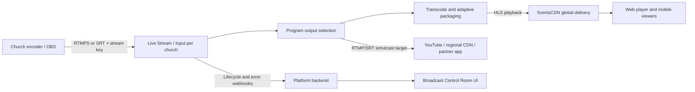

# Loveworld Broadcast Platform

## Purpose

This application is the control surface for a multi-church broadcast network:

- Each church publishes a live camera/program feed.
- Operators monitor feeds and select the program output.
- Admins create custom channels with RTMPS/SRT publish details and branded HLS playback links.
- The selected global output is pushed to partner platforms and regional destinations.
- Viewers watch an adaptive stream delivered through a CDN.

The frontend now prototypes those workflows. Production ingest credentials, CDN
playback URLs, webhooks, and access tokens must be issued by a backend service.
Recording/storage is intentionally disabled for the current version. Storage can
be added later from the 5centsCDN dashboard or another CDN/storage provider.

## Current Local Platform Mode

The app now defaults to the local broadcast server instead of the broken
Cloudflare Stream URL. The Cloudflare URL was invalid because its hostname label
was longer than DNS allows, so the manifest could not be resolved.

Current development endpoints:

- RTMP ingest: `rtmp://localhost/live`
- HLS playback: `http://localhost:8000/live/<stream-key>/index.m3u8`
- Admin API: `http://localhost:3001/api`

For a church to send a feed:

1. Admin creates a stream credential in the Broadcast control room.
2. The church opens OBS or a hardware encoder.
3. Server URL is `rtmp://YOUR_SERVER/live`.
4. Stream Key is the generated platform key.
5. The platform produces HLS at `/live/<stream-key>/index.m3u8`.

For remote churches, deploy the server with a public host:

```bash
SERVER_HOST=broadcast.yourdomain.com node server/index.js
```

## 5centsCDN Integration Mode

Your 5centsCDN dashboard/API account should be connected from the backend only,
not from browser JavaScript. The public 5centsCDN API documentation lists:

- Base URL: `https://api.5centscdn.com/v2`
- Auth header: `X-API-KEY: YOUR_API_KEY`
- Livestream tools for managing live streaming settings and resources.

Current no-storage integration:

1. The platform backend calls 5centsCDN `POST /streams/push/new` to create a real Push Stream for each church when API permissions allow it.
2. The admin UI returns the 5centsCDN encoder/FMS RTMP server, stream name/key, and HLS playback URL.
3. While API permissions are blocked, the backend can use a manual 5cents Push Stream from the dashboard.
4. The local RTMP server remains available for development or fallback, but CDN mode should use the generated/manual 5centsCDN credentials in OBS.
4. Keep DVR/storage disabled until you decide to enable storage from the 5centsCDN dashboard.
5. Store the 5centsCDN API key on the server as an environment variable, never in `js/config.js`.

Server environment placeholders:

```bash
FIVECENTS_API_BASE=https://api.5centscdn.com/v2
FIVECENTS_API_KEY=
FIVECENTS_ACCOUNT_ID=10244
FIVECENTS_API_PROFILE_ID=1151
FIVECENTS_STREAM_SERVER=209
MANUAL_PUSH_RTMP_URL=rtmp://fms-02-01.5centscdn.com/loveworld
MANUAL_PUSH_STREAM_KEY=network
MANUAL_PUSH_HLS_URL=
STORAGE_ENABLED=false
```

The API profile must have permission for Livestreams/Push Streams. If 5centsCDN
returns `Requested Operation Not Allowed`, enable the required permissions for
that API credential in the dashboard or create a new API credential with
Livestream access.

## Recommended MVP Pipeline

Use 5centsCDN as the preferred CDN account, with the local RTMP server acting as
the origin while storage remains off:

## Netlify Frontend Hosting

Netlify can host the website/frontend, but it cannot host the RTMP ingest server
or the Node Media Server process. For proper live testing:

1. Deploy this folder to Netlify using the included `netlify.toml`.
2. Host `server/` on a VPS/cloud machine with ports `1935`, `8000`, and `3001`
   open, or place `3001` behind HTTPS as `https://broadcast-api.yourdomain.com`.
3. Set `js/runtime-config.js` on the Netlify deploy to:

```js
window.LW_BROADCAST_SERVER_URL = 'https://broadcast-api.yourdomain.com';
```

4. Set the backend `.env` on the VPS:

```bash
SERVER_HOST=broadcast-api.yourdomain.com
RTMP_PORT=1935
HTTP_PORT=8000
API_PORT=3001
DISCONNECT_GRACE_MS=30000
FIVECENTS_API_BASE=https://api.5centscdn.com/v2
FIVECENTS_API_KEY=YOUR_SERVER_SIDE_KEY
FIVECENTS_STREAM_SERVER=209
STORAGE_ENABLED=false
```



5centsCDN supports live stream push/pull workflows and HLS playback output. The
platform can still generate local RTMP credentials for churches, then expose the
resulting HLS origin to 5centsCDN for global playback. For outbound push to
other destinations, add an FFmpeg/SRS worker that pushes the selected program
feed to configured RTMP/SRT endpoints.

For a later broadcast-grade deployment needing redundant pipelines and
fine-grained output control, use AWS MediaLive input switching and RTMP output
groups with MediaPackage and CloudFront, or SRS/OvenMediaEngine as a custom
origin/relay layer.

## Services To Build

### 1. Control API

The browser must never receive CDN/provider API tokens or stream keys belonging
to another church. Build an authenticated server API:

| Route | Purpose |
| --- | --- |
| `POST /api/churches/:id/live-inputs` | Provision an RTMPS/SRT live input and return one-time encoder setup details. |
| `POST /api/channels` | Create an admin-owned global channel with its publish key and HLS playback URL. |
| `POST /api/channels/:id/destinations` | Add an outbound RTMP/SRT simulcast destination. |
| `PATCH /api/channels/:id/destinations/:destinationId` | Start, pause, or remove outbound distribution. |
| `GET /api/broadcast/feeds` | Return status, bitrate, latency, active broadcast, and allowed preview URLs. |
| `POST /api/broadcast/program` | Select the source shown as the program output. |
| `GET /api/broadcast/playback` | Return signed HLS/DASH viewer playback details. |
| `POST /api/webhooks/stream` | Receive live started, ended, and error events. |

### 2. Database Model

Store these records:

| Entity | Required fields |
| --- | --- |
| `church` | `id`, `name`, `city`, `timezone`, `operator_user_id` |
| `live_input` | `church_id`, `provider_input_id`, `protocol`, encrypted `stream_key`, `status` |
| `broadcast` | `live_input_id`, `started_at`, `ended_at`, `status` |
| `program_output` | `broadcast_id`, `selected_by`, `selected_at`, `fallback_input_id` |
| `channel` | `name`, `slug`, `provider_live_stream_id`, `playback_id`, `custom_domain`, encrypted `stream_key` |
| `destination` | `channel_id`, `provider_target_id`, `protocol`, encrypted `destination_key`, `status` |

Encrypt stream keys at rest and display them once when provisioning. Issue a
new key immediately if one is exposed.

### 3. Church Encoder Setup

Start with OBS at each church:

1. Provision one live input for the church.
2. Provide the RTMPS server URL and its private stream key to that church's operator only.
3. Configure automatic reconnect and a stable upstream upload connection.
4. Test audio, resolution, keyframe interval, and failover before the first public broadcast.

Use SRT for sites with unstable connections or workflows needing better
transport resilience and richer audio/caption support.

### 4. Viewer Playback

The current app uses Video.js, which can play an HLS manifest. In production,
replace demo stream URLs with a backend-provided signed manifest, for example:

```js
player.src({
  src: playback.hlsUrl,
  type: 'application/x-mpegURL',
});
```

Use signed viewer URLs and allowed-origin restrictions for private meetings or
partner events. Use the stable stream key or provider Live Input ID for
recurring church channels.

### 5. Outbound Push Distribution

When the admin creates a destination, the backend creates a simulcast target
against the global channel. Destinations include social broadcasts, a partner
station receiving RTMPS, or a regional relay receiving SRT.

Do not send destination stream keys to ordinary viewers or church operators.
The backend stores them encrypted and supplies only health/status information
to the control room. Some managed services restrict when a simulcast target
can be created; for Mux, create targets while the parent live stream is idle.

## Security And Reliability

- Authenticate church operators and require role-based permission for creating inputs or changing program output.
- Keep provider API credentials only on the backend.
- Encrypt stored stream keys and rotate compromised keys.
- Validate provider webhook signatures or source authentication.
- Enable signed playback for restricted programs.
- Maintain a standby source and operator-controlled failover.
- Track ingest disconnects, transcoding errors, CDN playback failures, and audience metrics.

## Environment Configuration

The future backend will need secrets similar to:

```bash
FIVECENTS_API_BASE=https://api.5centscdn.com/v2
FIVECENTS_API_KEY=
FIVECENTS_ACCOUNT_ID=10244
FIVECENTS_API_PROFILE_ID=1151
PLAYBACK_SIGNING_KEY=
DATABASE_URL=
```

Do not add real values to the frontend or commit them to source control.

## Delivery Sequence

1. Create the backend API and authentication.
2. Connect `Create Channel` to the local RTMP origin and optionally to 5centsCDN Livestreams API.
3. Connect `Add Church Feed` to input provisioning for each church.
4. Connect `Add Destination` to outbound simulcast targets.
5. Receive webhooks to populate input and outbound push health.
6. Replace demo playback with real signed HLS manifests.
7. Pilot with two churches and one outbound destination before wider onboarding.
8. Add storage/recording later if you enable it in 5centsCDN or another provider.

## Provider Documentation

- 5centsCDN API introduction: https://developer.5centscdn.net/introduction.html
- 5centsCDN API docs: https://developer.5centscdn.net/
- 5centsCDN push/live ingest guide: https://www.5centscdn.net/help/how-to-push-or-ingest-a-live-stream-to-5centscdn/
- 5centsCDN output protocol guide: https://www.5centscdn.net/help/how-to-enable-required-output-protocol-for-live-streams/
- Cloudflare Stream live workflow alternative: https://developers.cloudflare.com/stream/stream-live/
- AWS live streaming architecture: https://docs.aws.amazon.com/solutions/latest/live-streaming-on-aws/architecture-overview.html
- SRS introduction and protocol conversion: https://ossrs.io/lts/en-us/docs/v5/doc/introduction
